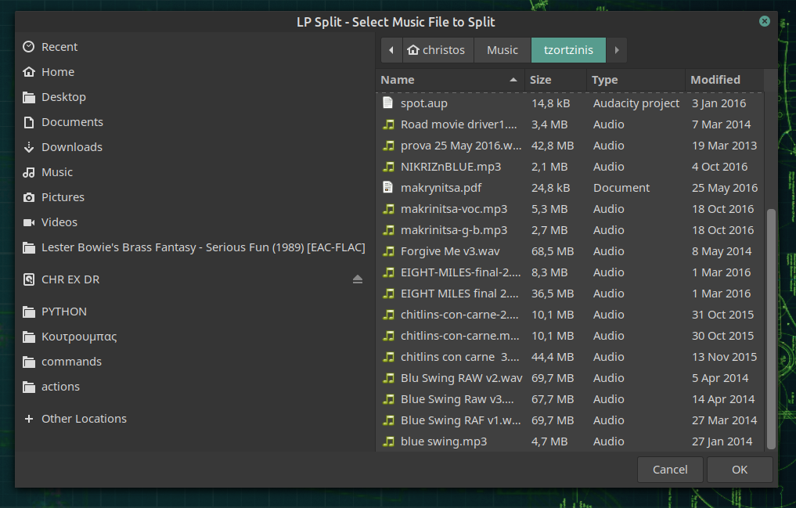
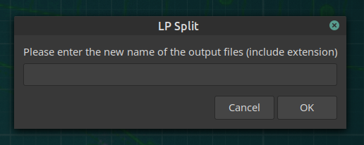
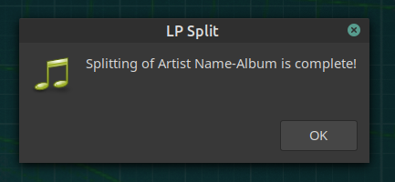

# LP_Split

A simple script that can split an audio file (LP/cassete) into smaller audio files, wherever it detects silence for 2 seconds.
This bash script uses the poweful **soX** (Sound eXchange, the Swiss Army knife of audio manipulation), and the main command comes straight from its man page.

## DEPENDENCIES

To be able to run this script, you need to install sox and zenity :

    sudo apt install sox zenity
 
## INSTALL

Change directory to lp_split, and make LP_split.sh executable:

    cd lp_split
    

    chmod  +x  LP_split.sh

## RUN

To run the script from the same directory:

    ./ LP_split.sh

You are welcomed by a file selection dialog:

After that, you are asked to enter the name  of the new, output files that will come from splitting the big audio file, eg song.wav:

Alast mssage will inform you when the splitting operation is complete  :

